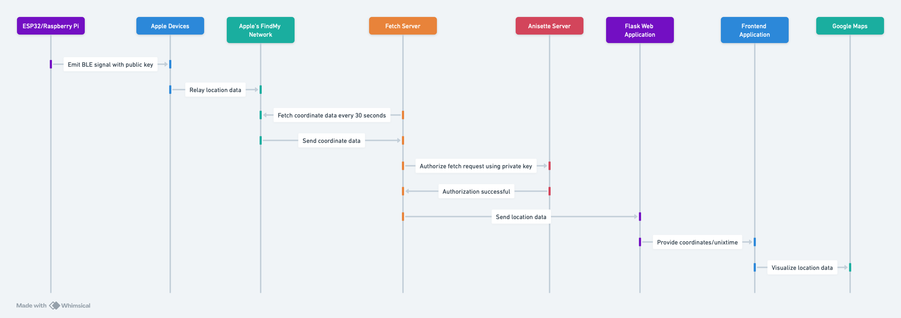
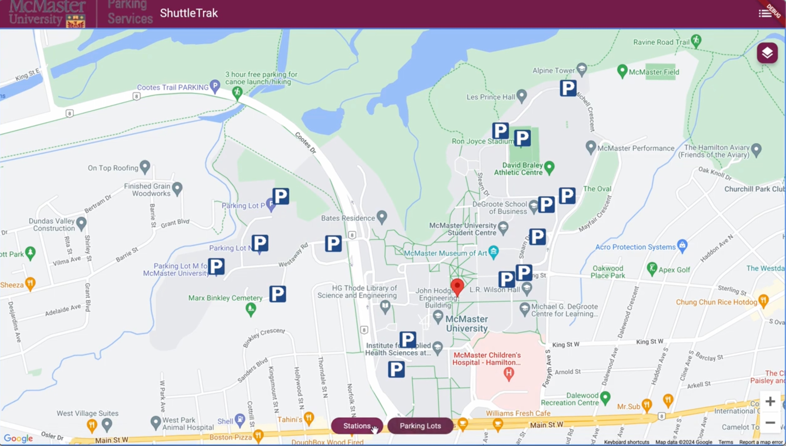
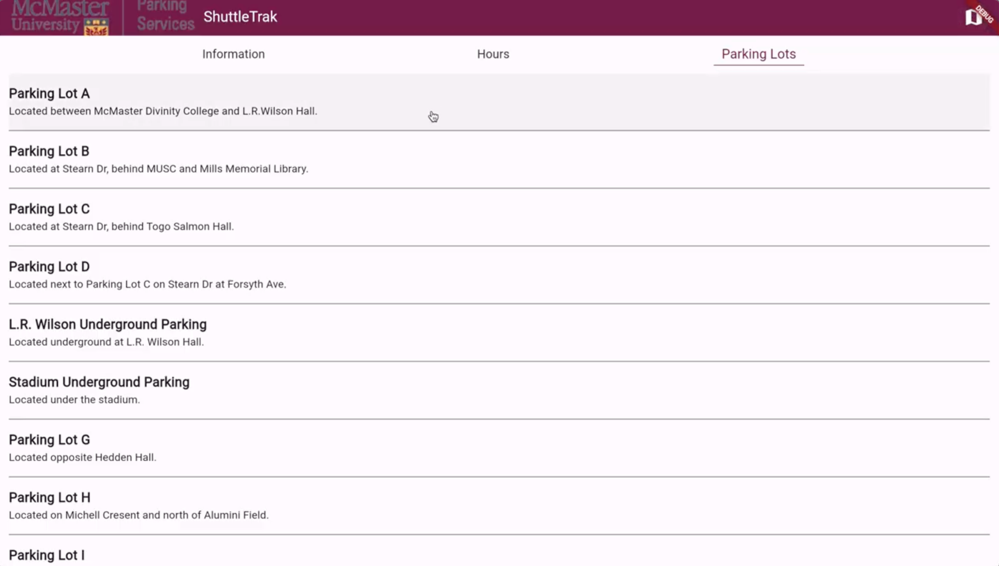

# ShuttleTrak (Project for Deltahacks X)

Hackathon project for Deltahacks X (36 hours)

A shuttle bus tracking app using Apple's FindMy Network to allow tracking without a constant data or GPS connection. Keep track of our university's Shuttle Bus Terminals, find live locations of buses, and estimate arrival times.

## How does it work?
We use a Linux-based microcontroller like the **ESP32 or Raspberry Pi Zero series** to emit a constant BLE signal with a **public key**, spoofing itself as an **iDevice**. This makes the microcontroller a part of Apple's FindMy network. We then parse the location data sent via other iDevices and upload our microcontroller's relative location by fetching the coordinate data every **30 seconds** from Apple's servers. We do this by creating an anisette server that authorizes our **fetcher** webserver using the **private key** paired to the **public key** that is sent to Apple's FindMy servers. Lastly, we organize this data into our Flask web application, and our frontend application is responsible for sending a **GET** request for the coordinates/unixtime and visualizing it on **Google Maps**.
&nbsp;

&nbsp;

- Benefits of this tracking method:
  - Extremely low power usage on the microcontroller as it uses Bluetooth Low Energy.
  - No need for a cellular signal or plan; it only needs nearby **Apple devices** to ping it.
  - Works anywhere in the world where there is or was an Apple device nearby.

## Frontend Information
Provides an interactive map that lets you access the real-time location of your shuttle bus and all the on-campus parking information you need. Simply click on any parking lot to see its daily price and handicap services availability, and easily search up their locations. See your shuttle bus in real-time on the map and get a time estimate of when it will arrive.
&nbsp;

&nbsp;
- Map of university with its bus stations, and the red marker (placeholder) indicating the current coordinate of the microcontroller

- Additional information useful for students
&nbsp;

## Simple Documentation
- Frontend: Flutter / Dart
- API used: Apple_Anisette, Openhaystack, Google Maps
- Backend: Python, Flask
- Hardware used in live demonstration:
  - Server: aarch64 or x86_64 system compatible with Python 3.11 to act as the webserver + parser/fetcher
  - Tracker: Raspberry Pi4 2GB with Raspbian 10 to act as the BLE device to ping nearby Apple Devices for information


## Deployment
 - Add your Google Maps API key at ./shuttletrak/web/index.html @ line 36
 - Run Dart Webserver from Root
 - Create a .env file for the webserver
   - ```
        SERVER_URL="http://{ServerIP}/post"
        GET_URL="http://{ServerIP}/getdata"
     ```
 - Run ./webserver.py for the server for GET and POST requests
 - Start the Anisette server by running ```docker run -d --restart always --name anisette-v3 -p 6969:6969 dadoum/anisette-v3-server:latest```
 - cd into the FindMy directory
   - Create the starting database by running ```sqlite3 reports.db 'CREATE TABLE reports (id_short TEXT, timestamp INTEGER, datePublished INTEGER, payload TEXT, id TEXT, statusCode INTEGER, LONGITUDE REAL, LATITUDE REAL,PRIMARY KEY(id_short,timestamp), )'```
 - Generate keys by running ```python3 /generatekeys.py``` inside the FindMy directory
 - Follow Openhaystack for deployment on the tracker device
 - Run the ```python3 runFetcher.py``` in the same directory as the .keys files

